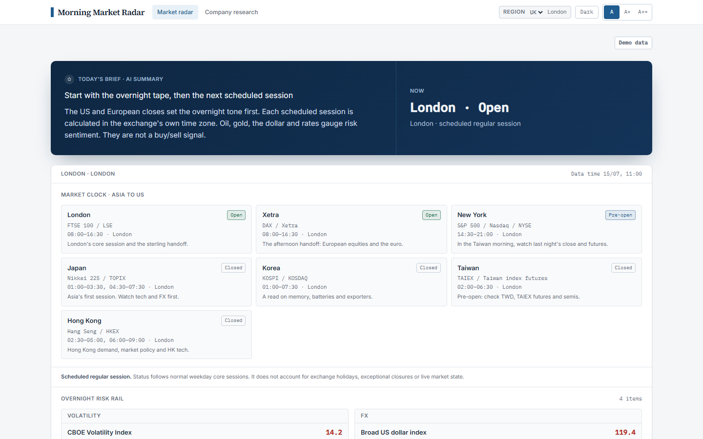

# Cited Market Brief Agent

[](https://github.com/rosscyking1115/cited-market-brief-agent/actions/workflows/ci.yml)
[](LICENSE)
[](https://cited-market-brief-agent.vercel.app)


Two things in one web app: a region-aware **Morning Market Radar** for everyday investors,
and an **evidence-backed brief engine** for research teams. The radar puts market context
and news in plain language, with Traditional-Chinese key points on the Taiwan edition. The
brief engine checks every claim against a stored source span before it ships.

> Bridges my fintech cluster
> ([responsible-neobank-growth](https://github.com/rosscyking1115/responsible-neobank-growth))
> and AI-safety cluster
> ([agent-release-gates](https://github.com/rosscyking1115/agent-release-gates)) —
> evidence-grounded LLM output, gated in CI. Full project map →
> [profile](https://github.com/rosscyking1115).


A claim that has no validated source span does not ship. The CI eval gate holds citation
precision at ≥ 0.95 and recall at ≥ 0.90, and fails the build on any advice-boundary leak.

> [!NOTE]
> **Scope.** I built this as a morning market tool for a family member who invests in Taiwan.
> It runs on free and end-of-day data (TWSE, FRED, NYT Most Popular, RSS). That is enough for
> a daily digest; it is not a trading terminal. It is not a commercial product, and nothing it
> produces is investment advice. See the disclaimer at the bottom.

## Live demo

[cited-market-brief-agent.vercel.app](https://cited-market-brief-agent.vercel.app) runs the
whole UI on built-in demo data, with no backend and no login. Pick any region and click
through the radar, news, ETF attribution, and the evidence brief. Deploy steps are in
[docs/DEPLOY_DEMO.md](docs/DEPLOY_DEMO.md).

The full app, on live data, runs privately and is available on request.

## Overview

The app has two surfaces on one page.

1. **Morning Market Radar** (primary, consumer). An Asia→US market clock, a FRED-backed
   overnight-risk rail, most-read finance news over day/week/month windows with AI
   summaries, and a Taiwan ETF-vs-benchmark attribution tool.
2. **Evidence-backed company brief** (secondary, professional). SEC filing changes and macro
   deltas, checked claim-by-claim against primary sources, with an exportable evidence ledger.

All four editions (Taiwan, Korea, UK, EU) render the same core radar, localised. Each then
carries one module suited to its reader: Taiwan gets the ETF tool, the other editions get
the evidence brief.

## Screenshots

Four localised editions (English · 繁體中文 · 한국어) render the same UI. The English edition
is shown first; the Taiwan edition adds a TWSE ETF-vs-benchmark tool.

| Morning radar — UK edition | Evidence ledger — UK/EU edition |
| --- | --- |
|  |  |
| **Taiwan edition — ETF vs. TAIEX attribution** | **Taiwan edition — most-read news (day / week / month)** |
|  |  |

> From the [live demo](https://cited-market-brief-agent.vercel.app) (demo data). The same radar
> renders in English, 繁體中文 and 한국어. Even the up/down colours follow the region: Taiwan
> uses red for up.

## Features

**Morning Market Radar**
- Region editions in 繁體中文, 한국어 and English, picked by region. Language, market anchor
  and copy all follow.
- A market clock covering Japan → Korea → Taiwan → HK/China → Europe → US, with live
  open/closed status.
- An overnight-risk rail: VIX, USD/TWD·JPY·CNY, the broad dollar, WTI and the US 10Y, from
  FRED (end-of-day) and Alpha Vantage (FX). Values are cached and persisted.
- Most-read finance news from the NYT Most Popular API over cumulative 1-day, 1-week and
  1-month windows. Finance RSS and GDELT add coverage; everything is finance-filtered.
- Taiwan digests: each headline cut down to Traditional-Chinese key points, plus
  today/this-week/this-month AI summaries. Best-effort and cached; it falls back to English.

**Taiwan ETF / fund attribution**
- Paste or upload holdings; missing daily returns are filled from TWSE.
- Fund vs. TAIEX active return, top contributors, biggest drags, and the full holdings table.
- Sector (產業) allocation attribution with a diverging-bar view, refreshed daily.

**Evidence-backed brief engine**
- Cited generation from SEC EDGAR filings and FRED/ALFRED macro series. The claim→span
  validator gates what ships.
- Click-through evidence ledger (quote, document, section, accession, checksum).
- Change detection: filing paragraph diffs and vintage-aware macro deltas.
- Per-section analyst review with approval gating, plus Markdown/PDF/PPTX/XLSX exports that
  respect review state, carry the watermark, and embed the EU AI-Act Art. 50 marking.

## Tech stack

- Frontend: Next.js 16 (App Router, RSC), React 19, TypeScript, Tailwind v4 with CSS-variable tokens.
- Backend: FastAPI on Python 3.13, SQLAlchemy 2.0, Alembic, Postgres 18 + pgvector (hybrid FTS + vector, RRF).
- AI: LiteLLM in library mode. Anthropic for generation and summaries, OpenAI for optional embeddings.
- Infra: Docker Compose, Caddy, Valkey, S3/MinIO.

Design tokens come from Salt, JPMorgan Chase's open-source design system.

## Getting started

> [!IMPORTANT]
> Prerequisites: Docker, Python 3.13, Node 20+. A `SEC_USER_AGENT` is required by SEC EDGAR;
> a `FRED_API_KEY` powers the overnight-risk rail. Everything else degrades gracefully.

```bash
cp .env.example .env          # fill in SEC_USER_AGENT and FRED_API_KEY at minimum
docker compose up -d db valkey minio

# Backend
cd backend
python -m venv .venv && . .venv/bin/activate     # Windows: .venv\Scripts\activate
pip install -e ".[dev]"
python scripts/bootstrap_db.py                   # pgvector extension + tables
uvicorn app.main:app --reload                    # http://localhost:8000/docs

# Frontend
cd ../frontend
npm install
npm run dev                                       # http://localhost:3000
```

With both running, http://localhost:3000 shows live data; without the backend it renders
demo data so the UI always works. The frontend proxies `/api/*` to the backend, so no CORS
setup is needed in dev.

Run the brief vertical slice end to end:

```bash
cd backend && python scripts/demo_brief.py
```

This ingests recent NVDA/AMD/AVGO filings plus CPI and 10Y series, generates a cited brief,
validates every claim, and exports `brief_<id>.md` + `.manifest.json` to `.data/exports/`.

## Configuration

Key environment variables (full list in `.env.example`):

| Variable | Purpose |
| --- | --- |
| `SEC_USER_AGENT` | Required by SEC EDGAR: a declared identifying User-Agent. |
| `FRED_API_KEY` | Overnight-risk rail and macro series. |
| `NYT_ENABLED`, `NYT_API_KEY` | Most-read finance news (1d/1w/1m most-viewed). |
| `BBC_RSS_ENABLED`, `GDELT_ENABLED` | Finance RSS feeds and coverage discovery. |
| `ALPHA_VANTAGE_ENABLED`, `ALPHA_VANTAGE_API_KEY` | Live FX rates. |
| `ANTHROPIC_API_KEY`, `GENERATION_MODEL` | Brief generation and news report summaries. |
| `TRANSLATION_MODEL` | Traditional-Chinese key-point translation. |
| `OPENAI_API_KEY` | Optional embeddings for hybrid retrieval. |
| `DATABASE_URL`, `VALKEY_URL`, `S3_*` | Postgres, cache, raw source storage. |

If a data-source key is missing, that source switches off and the page still renders.

## Deployment

The staging stack (`docker-compose.staging.yml`) runs Caddy, the Next.js frontend, the
FastAPI backend, a scheduler, a one-shot DB bootstrap, Postgres, and Valkey. Caddy serves
the frontend and reverse-proxies `/api/*` to the backend.

```bash
dc() { docker compose --env-file .env.staging -f docker-compose.staging.yml "$@"; }
dc build backend frontend && dc up -d
```

Put real keys in `.env.staging` (gitignored). News is prewarmed at startup and refreshed in
the background (stale-while-revalidate), so pages never block on the live fetch + translation.

## Data sources and compliance

- SEC EDGAR: declared User-Agent, ≤10 req/s, enforced in `backend/app/connectors/sec_edgar.py`.
- FRED / ALFRED: macro series and revisions. This product uses the FRED® API but is not
  endorsed or certified by the Federal Reserve Bank of St. Louis.
- NYT Most Popular: headline and link only, linked back to nytimes.com per the developer
  terms. Article body text is never reproduced.
- TWSE: end-of-day prices and industry classification for the ETF attribution.
- GDELT and finance RSS: coverage and latest headlines, labelled as such. Neither is called
  "most read".

## Testing

```bash
cd backend && python -m pytest -q            # unit + integration (116 tests)
cd backend && python scripts/run_evals.py    # citation precision ≥0.95, recall ≥0.90, zero advice leaks
cd frontend && npx tsc --noEmit && npx next build
```

## Project structure

```
backend/app/
  api/routes/        health, watchlists, ingest, briefs, market-radar, fund-attribution
  connectors/        SEC EDGAR, FRED, NYT, GDELT, finance RSS, TWSE, Alpha Vantage
  ingestion/         structure-aware filing parser (char spans), pipeline
  rag/               embeddings (optional), hybrid FTS+vector retrieval, RRF
  briefs/            cited generator + offline fallback, claim→span validator, exports
  market_radar/      clock, overnight risk, news assembly + translation + summaries
  fund_attribution/  holdings parsing, fund/sector attribution, daily refresh
  storage/ db/ services/   raw source store, SQLAlchemy models, append-only audit log
frontend/
  app/components/    radar dashboard, hero, ETF tool, evidence ledger, brief canvas
  lib/               api client, region profiles, radar i18n
docs/                design system, security posture, architecture and deploy guides
```

> [!WARNING]
> Factual, cited, non-personalised. Not investment advice, not a recommendation, and not an
> offer to buy or sell any security. AI-assisted content; human review is required before any
> external use.
