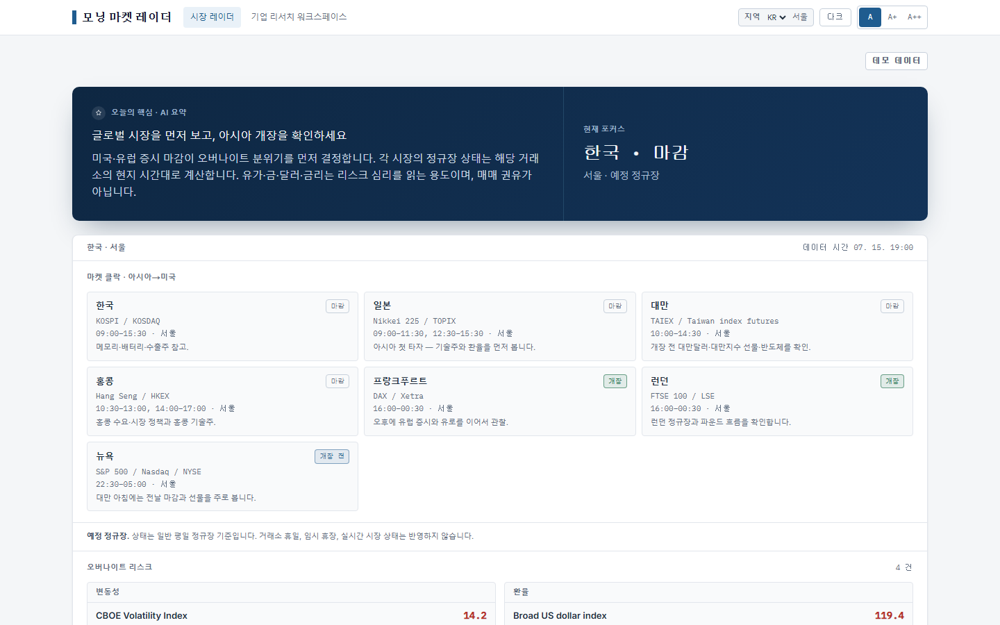
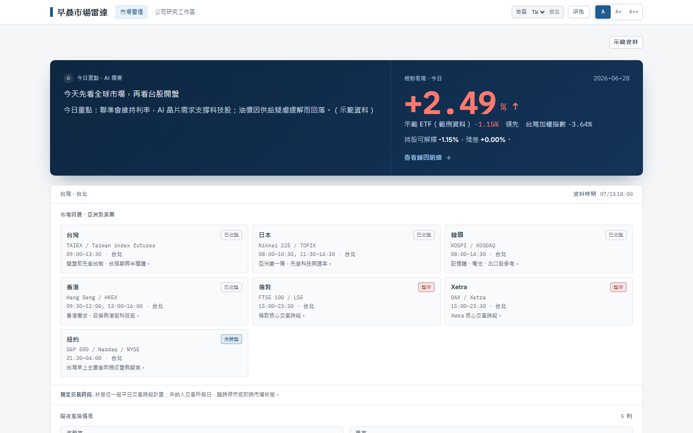
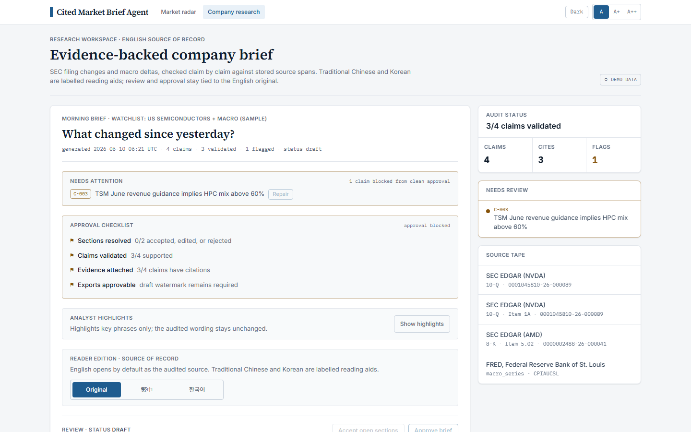
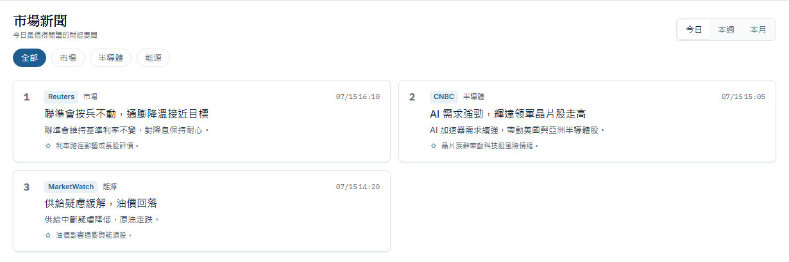

# Cited Market Brief Agent

[](https://github.com/rosscyking1115/cited-market-brief-agent/actions/workflows/ci.yml)
[](LICENSE)


One market-intelligence workbench with two deliberately separate routes:

- `/` is the region-aware **Morning Market Radar** for a quick, sourced view of the trading day.
- `/brief` is the **evidence-backed company research workspace**, where supported claims map to stored source spans and unsupported claims are flagged for human review.

The split matters. The radar is built for scanning; the brief is the project's original cited-AI proof and remains the English audited source of record. Traditional Chinese and Korean versions of the brief are labelled reading aids.


> [!IMPORTANT]
> This is a research and portfolio project, not a trading terminal. It provides factual, non-personalised information and is not investment advice, a recommendation, or an offer to buy or sell a security.

## What is included

### Morning Market Radar — `/`

- Four editions selected with `?region=tw|kr|uk|eu`. A valid URL value wins over the saved preference; otherwise the app uses local storage and then the edition chooser.
- A typed Traditional Chinese, Korean and English catalogue for the radar shell, categories, controls, market labels and limitations.
- Seven separate scheduled regular/core sessions: Japan, Korea, Taiwan, Hong Kong, London, Xetra and New York. Each is calculated in its exchange's IANA time zone and displayed in Taipei, Seoul, London or Brussels time for the chosen edition.
- A sourced global overnight-risk rail and finance-news feed. Korea, UK and EU localise that existing global coverage; they do not claim complete local-market feeds.
- Taiwan-only USD/TWD context and ETF-versus-TAIEX attribution. These modules are not implied for other regions.
- One cached news-translation batch for Traditional Chinese and Korean. If no suitable model key is configured, the English source text remains visible and is clearly marked as original-language content.

The session clock is schedule-derived. It handles local weekdays and daylight-saving changes, but it does **not** account for exchange holidays, exceptional closures or live market state.

### Company research workspace — `/brief`

- SEC filing changes and FRED/ALFRED macro deltas assembled into a cited company brief.
- Claim-level validation maps supported statements to stored source spans, with document, section, accession and checksum evidence; unsupported statements are flagged for review.
- An approval checklist and review states that stop unresolved claims from being presented as approved output.
- English as the audited source of record. Traditional Chinese and Korean are optional reading aids and do not alter the reviewed English wording.
- Markdown, PDF, PPTX and XLSX export paths that preserve review state and provenance.

The CI evaluation gate requires citation precision of at least 0.95, recall of at least 0.90 and zero advice-boundary leaks.

## Verified local captures

These images come from the deterministic frontend demo build after the full test and accessibility gates passed. The four route captures are 1440×900.

| UK radar | Korea radar |
| --- | --- |
|  |  |
| **Taiwan radar** | **Company research workspace** |
|  |  |

Static, repeatable Taiwan news capture:



The existing [public demo](https://cited-market-brief-agent.vercel.app) is a frontend-only demo deployment and may trail this repository until a separate deployment is approved. Deployment instructions are in [docs/DEPLOY_DEMO.md](docs/DEPLOY_DEMO.md).

## Regional scope, without overclaiming

| Edition | Interface and clock | Data scope |
| --- | --- | --- |
| Taiwan | Traditional Chinese; Taipei time | Global radar plus Taiwan-specific USD/TWD and ETF attribution |
| Korea | Korean; Seoul time | Localised view of the sourced global radar |
| UK | English; London time | Localised view of the sourced global radar |
| EU | English; Brussels time | Localised view of the sourced global radar |

Published session hours are checked against the exchanges' primary documentation. The exact sources, public wording and retained tests are recorded in the [public claim ledger](docs/claims/claim-ledger.md).

## Technology

- **Frontend:** Next.js 16 App Router, React 19, TypeScript and Tailwind CSS v4.
- **Backend:** FastAPI, Python 3.13, SQLAlchemy 2, Alembic and Postgres with pgvector.
- **Retrieval and generation:** hybrid full-text/vector retrieval with reciprocal-rank fusion; LiteLLM in library mode for configured Anthropic or OpenAI models.
- **Infrastructure:** Docker Compose, Caddy, Valkey and S3/MinIO.
- **Design:** a Salt-derived token system implemented locally. The project does not depend on shadcn, TanStack or TradingView components.

## Getting started

Prerequisites: Docker, Python 3.13 and Node 20+. SEC EDGAR requires a declared `SEC_USER_AGENT`; the FRED rail requires `FRED_API_KEY`. Other integrations degrade gracefully when their keys are absent.

```bash
cp .env.example .env
docker compose up -d db valkey minio

# Backend
cd backend
python -m venv .venv
# Windows: .venv\Scripts\activate
# macOS/Linux: source .venv/bin/activate
pip install -e ".[dev]"
python scripts/bootstrap_db.py
uvicorn app.main:app --reload

# Frontend, in another terminal
cd frontend
npm install
npm run dev
```

The frontend is available at `http://localhost:3000`; FastAPI documentation is at `http://localhost:8000/docs`. With no backend, the frontend falls back to labelled demo data.

Run the brief vertical slice:

```bash
cd backend
python scripts/demo_brief.py
```

This ingests the configured filing and macro sources, generates a cited draft, validates its claims and writes review-aware export artefacts under `.data/exports/`.

## Configuration

The full list is in [.env.example](.env.example). The main controls are:

| Variable | Purpose |
| --- | --- |
| `SEC_USER_AGENT` | Required identifying user agent for SEC EDGAR. |
| `FRED_API_KEY` | Macro series and the global overnight-risk rail. |
| `NYT_ENABLED`, `NYT_API_KEY` | NYT Most Popular headline and link data. |
| `BBC_RSS_ENABLED`, `GDELT_ENABLED` | Latest-headline and coverage-discovery sources. |
| `ALPHA_VANTAGE_ENABLED`, `ALPHA_VANTAGE_API_KEY` | Optional market-data pilot, including Taiwan FX context. |
| `GENERATION_MODEL` | LiteLLM model identifier for brief generation and summaries. |
| `TRANSLATION_MODEL` | LiteLLM model identifier for Traditional Chinese and Korean reading aids. |
| `ANTHROPIC_API_KEY`, `OPENAI_API_KEY` | Provider keys selected according to the configured model. OpenAI also supports optional embeddings. |
| `DATABASE_URL`, `VALKEY_URL`, `S3_*` | Database, cache and raw-source storage. |
| `NEXT_PUBLIC_DEMO_MODE=1` | Builds the deterministic, backend-free frontend demo. |

## Data and source boundaries

- **SEC EDGAR:** declared user agent and a maximum request rate enforced by the connector.
- **FRED / ALFRED:** macro series and historical revisions. This project uses the FRED API but is not endorsed or certified by the Federal Reserve Bank of St. Louis.
- **NYT Most Popular:** headline and link only, with links back to the original publisher. Article bodies are not reproduced.
- **TWSE:** end-of-day prices and classifications for the Taiwan attribution workflow.
- **GDELT and finance RSS:** coverage discovery and latest headlines. They are never described as readership data.
- **Exchange schedules:** JPX, KRX, TWSE, HKEX, LSE, Deutsche Börse and NYSE primary documentation, linked from the [claim ledger](docs/claims/claim-ledger.md).

## Verification

```bash
# Backend
cd backend
ruff check .
ruff format --check .
pytest -q
python scripts/run_evals.py

# Frontend
cd frontend
npm test
npm run typecheck
# PowerShell
$env:NEXT_PUBLIC_DEMO_MODE="1"; npm run build
# macOS/Linux
NEXT_PUBLIC_DEMO_MODE=1 npm run build
npm run test:e2e
```

The retained suite currently covers 122 backend tests, 29 frontend unit tests and 8 Playwright/axe browser cases. The browser matrix exercises all four editions and `/brief` at desktop, mobile and a 200%-zoom-equivalent width, across light/dark and reduced-motion modes. It also checks route separation, language metadata, keyboard/modal behaviour, horizontal overflow and serious/critical accessibility findings.

To reproduce the documentation images after a verified demo-mode build:

```bash
cd frontend
npm run capture:readme
```

## Project map

```text
frontend/
  app/page.tsx             Morning Market Radar route
  app/brief/page.tsx       company research workspace route
  app/components/          shared navigation and route-specific interfaces
  lib/radar-i18n.ts        typed regional catalogue
  lib/demo-data.ts         deterministic demo fixtures
  e2e/                     regional, route and accessibility matrix

backend/app/
  market_radar/            session schedules, risk data, news and translations
  briefs/                  generation, validation, review and reading aids
  connectors/              SEC, FRED, news, TWSE and optional market data
  fund_attribution/        Taiwan holdings and benchmark attribution
  rag/                     hybrid retrieval

docs/
  claims/claim-ledger.md   public claims, limitations, sources and retained evidence
  adr/                     architecture decisions
  screenshots/             deterministic README captures
```

## Licence and disclaimer

The code is available under the [MIT licence](LICENSE).

Outputs are AI-assisted and require human review before external use. They are factual and non-personalised, not investment advice, not a recommendation and not an offer to buy or sell any security.
