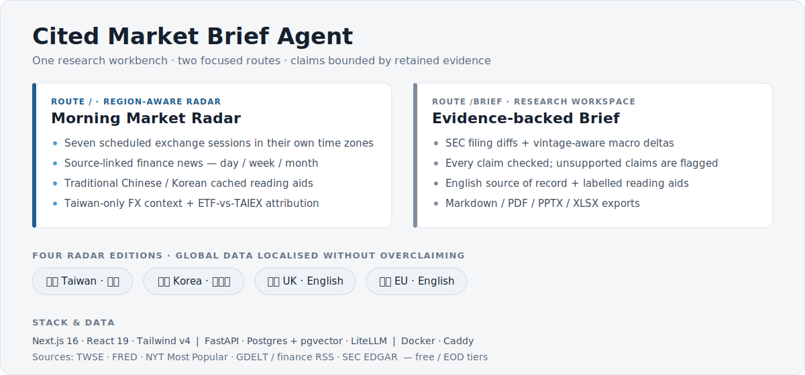
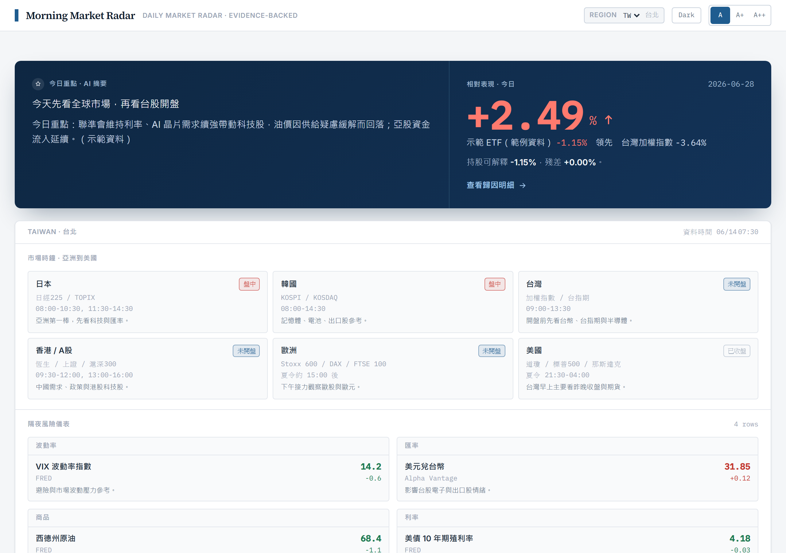
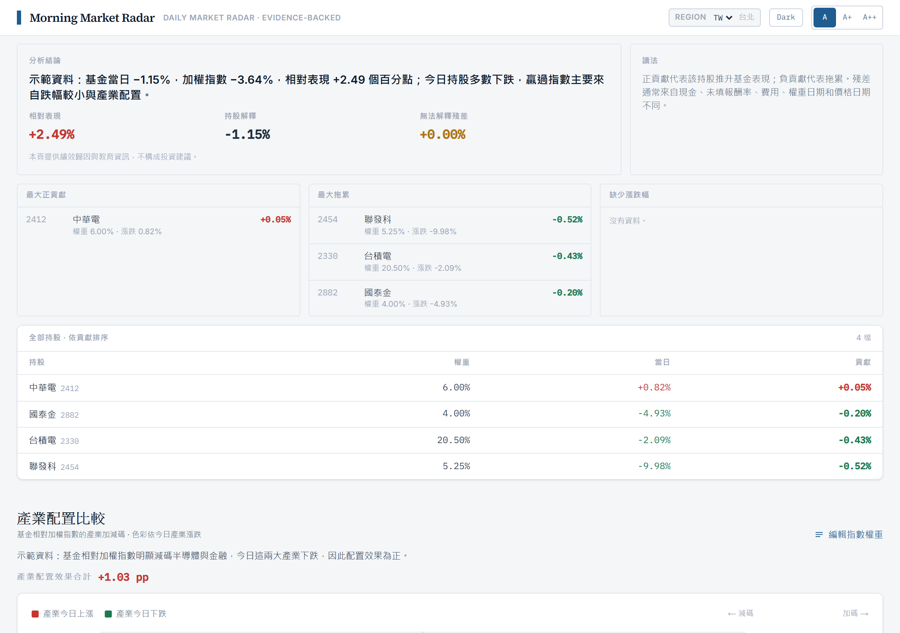
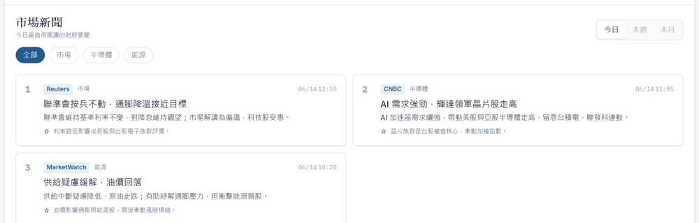
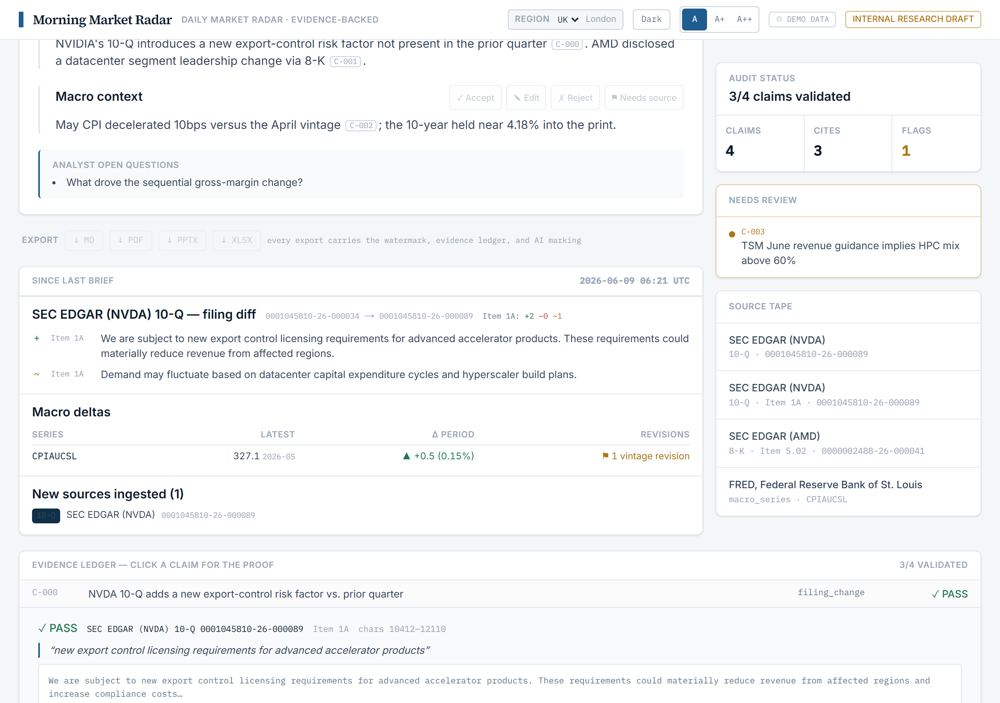

# Cited Market Brief Agent

[](https://cited-market-brief-agent.vercel.app)


A region-aware **Morning Market Radar** for everyday investors, plus an audit-ready
**evidence-backed brief engine** for research teams — in one web app. Market context and
news are surfaced in plain language (with Traditional-Chinese key points for the Taiwan
edition), and every claim in a generated research brief is validated against a stored
source span before it ships.



**Citation integrity:** every material claim is validated against a stored source span
before it ships — precision ≥ 0.95, recall ≥ 0.90, enforced by the CI eval gate.

> [!NOTE]
> **Honest framing.** This started as a daily market tool for a family member who invests
> in Taiwan, and grew into a portfolio-grade full-stack project. It runs on free/EOD data
> tiers (TWSE, FRED, NYT Most Popular, RSS) — great for a personal morning digest, not a
> Bloomberg replacement. It is **not** a commercial product, and nothing it produces is
> investment advice. See the disclaimer at the bottom.

## Live demo

**[cited-market-brief-agent.vercel.app](https://cited-market-brief-agent.vercel.app)** — a
no-login public demo with built-in demo data (no backend). Pick any region and click through
the radar, news, ETF attribution, and the evidence brief. Deploy details:
[docs/DEPLOY_DEMO.md](docs/DEPLOY_DEMO.md).

The full app (live data) runs privately and is available on request.

## Overview

The app has two surfaces on one page:

1. **Morning Market Radar** (primary, consumer) — an Asia→US market clock, a FRED-backed
   overnight-risk rail, most-read finance news over day/week/month windows with AI
   summaries, and a Taiwan ETF-vs-benchmark attribution tool.
2. **Evidence-backed company brief** (secondary, professional) — SEC filing changes and
   macro deltas, validated claim-by-claim against primary sources, with an exportable
   evidence ledger.

All four regional editions (Taiwan, Korea, UK, EU) render the same core radar, localized.
Each then carries one audience-specific module: Taiwan gets the ETF tool; the other
editions get the evidence brief.

## Screenshots

| Taiwan morning radar | ETF vs. TAIEX attribution |
| --- | --- |
|  |  |
| **Most-read news — day / week / month** | **Evidence ledger (UK/EU edition)** |
|  |  |

> Screenshots are from the [live demo](https://cited-market-brief-agent.vercel.app) (demo data).

## Features

**Morning Market Radar**
- Region editions — 繁體中文 / 한국어 / English, auto-selected by region (language, market
  anchor, and copy adapt).
- Market clock — Japan → Korea → Taiwan → HK/China → Europe → US with live open/closed status.
- Overnight-risk rail — VIX, USD/TWD·JPY·CNY, broad dollar, WTI, US 10Y from FRED (EOD) and
  Alpha Vantage (FX), cached and persisted.
- Most-read finance news — genuine readership via the NYT Most Popular API over 1-day /
  1-week / 1-month (cumulative) windows, plus finance RSS and GDELT, finance-filtered.
- Taiwan digests — each headline translated to Traditional-Chinese key points, with
  today/this-week/this-month AI report summaries. Best-effort and cached; English fallback.

**Taiwan ETF / fund attribution**
- Paste or upload holdings; fill missing daily returns from TWSE.
- Fund vs. TAIEX active return, top contributors, biggest drags, full holdings table.
- Sector (產業) allocation attribution with a diverging-bar view; daily auto-refresh.

**Evidence-backed brief engine**
- Cited generation from SEC EDGAR filings + FRED/ALFRED macro series — a claim without a
  validated source span does not ship.
- Click-through evidence ledger (quote, document, section, accession, checksum).
- Change detection: filing paragraph diffs and vintage-aware macro deltas.
- Per-section analyst review with approval gating, and Markdown/PDF/PPTX/XLSX exports
  (review-state-aware, watermarked, EU AI-Act Art. 50 marking embedded).

## Tech stack

- **Frontend** — Next.js 16 (App Router, RSC), React 19, TypeScript, Tailwind v4 (CSS-variable tokens).
- **Backend** — FastAPI (Python 3.13), SQLAlchemy 2.0, Alembic, Postgres 18 + pgvector (hybrid FTS + vector, RRF).
- **AI** — LiteLLM (library mode): Anthropic for generation/summaries, OpenAI for optional embeddings.
- **Infra** — Docker Compose, Caddy reverse proxy, Valkey, S3/MinIO.

Design tokens are derived from Salt (JPMorgan Chase's open-source design system).

## Getting started

> [!IMPORTANT]
> Prerequisites: Docker, Python 3.13, Node 20+. A `SEC_USER_AGENT` is required by SEC EDGAR;
> a `FRED_API_KEY` powers the overnight-risk rail. Everything else degrades gracefully.

```bash
cp .env.example .env          # fill in SEC_USER_AGENT and FRED_API_KEY at minimum
docker compose up -d db valkey minio

# Backend
cd backend
python -m venv .venv && . .venv/bin/activate     # Windows: .venv\Scripts\activate
pip install -e ".[dev]"
python scripts/bootstrap_db.py                   # pgvector extension + tables
uvicorn app.main:app --reload                    # http://localhost:8000/docs

# Frontend
cd ../frontend
npm install
npm run dev                                       # http://localhost:3000
```

With both running, http://localhost:3000 shows live data; without the backend it renders
demo data so the UI always works. The frontend proxies `/api/*` to the backend, so no CORS
setup is needed in dev.

Run the brief vertical slice end to end:

```bash
cd backend && python scripts/demo_brief.py
```

This ingests recent NVDA/AMD/AVGO filings plus CPI and 10Y series, generates a cited brief,
validates every claim, and exports `brief_<id>.md` + `.manifest.json` to `.data/exports/`.

## Configuration

Key environment variables (full list in `.env.example`):

| Variable | Purpose |
| --- | --- |
| `SEC_USER_AGENT` | Required by SEC EDGAR — a declared identifying User-Agent. |
| `FRED_API_KEY` | Overnight-risk rail and macro series. |
| `NYT_ENABLED`, `NYT_API_KEY` | Most-read finance news (1d/1w/1m most-viewed). |
| `BBC_RSS_ENABLED`, `GDELT_ENABLED` | Finance RSS feeds and coverage discovery. |
| `ALPHA_VANTAGE_ENABLED`, `ALPHA_VANTAGE_API_KEY` | Live FX rates. |
| `ANTHROPIC_API_KEY`, `GENERATION_MODEL` | Brief generation and news report summaries. |
| `TRANSLATION_MODEL` | Traditional-Chinese key-point translation. |
| `OPENAI_API_KEY` | Optional embeddings for hybrid retrieval. |
| `DATABASE_URL`, `VALKEY_URL`, `S3_*` | Postgres, cache, raw source storage. |

Missing data-source keys disable that source rather than breaking the page.

## Deployment

The staging stack (`docker-compose.staging.yml`) runs Caddy, the Next.js frontend, the
FastAPI backend, a scheduler, a one-shot DB bootstrap, Postgres, and Valkey. Caddy serves
the frontend and reverse-proxies `/api/*` to the backend.

```bash
dc() { docker compose --env-file .env.staging -f docker-compose.staging.yml "$@"; }
dc build backend frontend && dc up -d
```

Put real keys in `.env.staging` (gitignored). News is prewarmed at startup and refreshed in
the background (stale-while-revalidate), so pages never block on the live fetch + translation.

## Data sources and compliance

- **SEC EDGAR** — declared User-Agent, ≤10 req/s (enforced in `backend/app/connectors/sec_edgar.py`).
- **FRED / ALFRED** — macro series and revisions. This product uses the FRED® API but is not
  endorsed or certified by the Federal Reserve Bank of St. Louis.
- **NYT Most Popular** — headline + link only, linked back to nytimes.com per the developer
  terms; article body text is never reproduced.
- **TWSE** — end-of-day prices and industry classification for ETF attribution.
- **GDELT / finance RSS** — coverage and latest headlines, labeled as such (never "most read").

## Testing

```bash
cd backend && python -m pytest -q            # unit + integration (116 tests)
cd backend && python scripts/run_evals.py    # citation precision ≥0.95, recall ≥0.90, zero advice leaks
cd frontend && npx tsc --noEmit && npx next build
```

## Project structure

```
backend/app/
  api/routes/        health, watchlists, ingest, briefs, market-radar, fund-attribution
  connectors/        SEC EDGAR, FRED, NYT, GDELT, finance RSS, TWSE, Alpha Vantage
  ingestion/         structure-aware filing parser (char spans), pipeline
  rag/               embeddings (optional), hybrid FTS+vector retrieval, RRF
  briefs/            cited generator + offline fallback, claim→span validator, exports
  market_radar/      clock, overnight risk, news assembly + translation + summaries
  fund_attribution/  holdings parsing, fund/sector attribution, daily refresh
  storage/ db/ services/   raw source store, SQLAlchemy models, append-only audit log
frontend/
  app/components/    radar dashboard, hero, ETF tool, evidence ledger, brief canvas
  lib/               api client, region profiles, radar i18n
docs/                product & security plans, design system
```

> [!WARNING]
> Factual, cited, non-personalized. Not investment advice, not a recommendation, and not an
> offer to buy or sell any security. AI-assisted content — human review is required before
> any external use.
