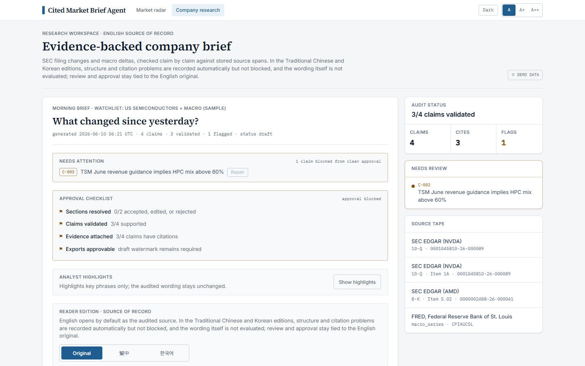
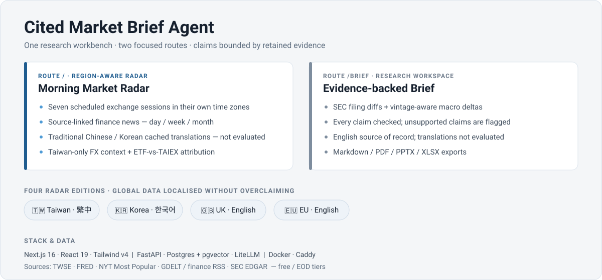

# Cited Market Brief Agent

**When a generated sentence cites a source, does that source actually say it?**

This project builds cited company research briefs from SEC filings and FRED macro
data, and then tries to answer that question about its own output honestly. The
answer is not flattering, and reporting it is the point: a deterministic checker
that verifies where a quote came from catches fabricated and misfiled citations
reliably, and still accepts more unsupported claims than supported ones.


[](https://github.com/rosscyking1115/cited-market-brief-agent/blob/main/LICENSE)
[](https://github.com/rosscyking1115/cited-market-brief-agent/actions/workflows/ci.yml)



> **Status: working demonstration, actively developed, not a product.** It is a
> research and portfolio project, not a trading terminal. There is no support
> commitment. Outputs are AI-assisted and require human review before external
> use; they are factual and non-personalised, and are not investment advice, not
> a recommendation and not an offer to buy or sell any security. Released under
> the [MIT Licence](https://github.com/rosscyking1115/cited-market-brief-agent/blob/main/LICENSE).

## Who this is for

Anyone building retrieval-grounded generation who needs to know what a citation
check is worth. The interesting artifact here is not the brief — it is the
labelled corpus, the confusion matrix and the negative controls that measure the
checker, including the cases it cannot see.

## What the citation check does and does not do

The validator checks **provenance** — the cited span exists, and the quoted text
appears verbatim inside it — plus two **consistency** rules: the claim may not
assert a number or a period that the cited evidence does not contain. It does
**not** check entailment. A claim whose defect is semantic is still accepted:
"the government granted licences that would allow us to ship" read as "we
shipped", a real effect given an invented cause, an all-time high inferred from a
three-week series.

It also **wrongly refuses** a shape of claim, and this is the sharpest limit
available. The numeric rule is set-subset over canonicalised numeric literals, so
a claim restating the cited span's own figure in equivalent notation asserts a
number the span does not contain. Against the real AMD 8-K span reading
"$5.0 billion":

| Claim says | Verdict |
|---|---|
| `$5.0 billion` | accepted |
| `$5 billion` | accepted |
| `$5,000 million` | **refused** — `numeric: 5000 not in the cited evidence` |

Nothing in the corpora triggers it, because every supported claim in them happens
to restate figures the way its span wrote them. Pinned in
`backend/tests/test_consistency.py` so it cannot quietly stop being true.

**How to read these numbers.** Unit: one claim. Positive: the system marks a
claim *supported*. Ground truth: a human label, recorded independently of the
system's output, answering "does the cited span support this claim?".
Population: every labelled claim in the named corpus.

- **precision** — of the claims the system accepted, the share the cited span really supports
- **recall** — of the claims the cited span really supports, the share the system accepted
- **specificity** — of the claims the cited span does *not* support, the share the system refused
- **true-but-unsupported refused** — the same, restricted to claims that are true but cited to a span that does not carry them. The hardest cell, and the one a provenance-only checker is blind to

Measured against claims labelled independently of the generator, built from real
10-Q and 8-K filings and real FRED vintages. **The "accept everything" column is
the null this has to beat** — a system that never refuses anything, scored the
same way:

| | development | dev, accept-everything | held-out | held-out, accept-everything |
|---|---|---|---|---|
| citation precision | 0.579 | 0.355 | **0.400** | 0.286 |
| citation recall | 1.000 | 1.000 | 1.000 | 1.000 |
| false negatives | 0 | 0 | 0 | 0 |
| specificity | 0.600 | 0.000 | 0.400 | 0.000 |
| true-but-unsupported refused | 6/8 | 0/8 | 2/6 | 0/6 |

**The figure that describes this system is precision 0.400 on the held-out
corpus** — of the claims it accepts, 40% are genuinely supported by the span they
cite, so 60% are not.

Read the null column before the rest. **Recall 1.000 and zero false negatives are
reproduced exactly by accepting everything**, so on their own they do not separate
this system from a system that does no checking at all. What separates it is
specificity and the true-but-unsupported row, where the null scores zero and this
does not: across both corpora it refused 20 claims and every one of those
refusals was correct.

Recall 1.000 therefore means something narrower than it looks: **no genuinely
supported claim in either corpus was refused.** That is a property of these
corpora rather than a guarantee — see the notation limit below.

The held-out corpus was authored after the consistency rules were frozen and
scored once, over two 8-Ks, second FRED vintages and unused 10-Q sections. Its
independence is partial, and the overlap is stated rather than glossed: excluding
the claims that touch a shared document and section gives 0.429, so the overlap
depresses the headline figure rather than flattering it. 0.579 is the development
corpus, which the rules were built against, and is not quoted on its own. On the
two shapes the rules target they generalise cleanly to unseen filings; on
semantic defects they catch none.

Method, per-trap breakdown, negative controls, the open empty-quote defect and
the full limits: [`docs/EVAL_METHODOLOGY.md`](docs/EVAL_METHODOLOGY.md).

The gate is a **ratchet** at the measured level, so any regression fails CI while
progress stays possible; ≥0.95 precision remains the target, not an achieved
figure. Also blocking: the negative controls and a zero advice-boundary leak
count.

## The English brief is the only thing measured

Traditional Chinese and Korean versions of the brief exist. Their **structure and
citations are checked automatically** — section count and order, every citation
marker still in its own section, and no figure the English draft never stated. A
translation failing any of those is returned marked for review rather than
silently.

**Their wording is not evaluated.** Nothing measures whether a translation says
what the English said, or whether a citation still supports its claim once both
are read in the target language — and that last failure mode is real, because the
check that gives a claim its support is performed on the English text only. The
shape checks cannot see it: they count markers and compare numerals, which is
worth having and is not a reading of meaning.

Radar news translations are a step behind that again: **no checks run on them at
all.** Treat the English brief as the source of record in the strict sense — it
is the only version any number on this page describes.

## Getting started

```bash
cp .env.example .env
docker compose up -d db valkey minio
```

```bash
cd backend
pip install -e ".[dev]"
python scripts/bootstrap_db.py
uvicorn app.main:app --reload
```

Reproduce the figures above without a database or a network:

```bash
cd backend
python scripts/run_evals.py
```

Full setup, configuration, the verification suite and the project map are in
[`docs/DEVELOPING.md`](docs/DEVELOPING.md).

## The second route

`/brief` is the cited research workspace described above. `/` is the **Morning
Market Radar**, a region-aware scanning view of the trading day built on the same
connectors and the same source-boundary rules — four editions, seven scheduled
exchange sessions, a sourced global risk rail. It is a different job: the brief
is read carefully once, the radar is glanced at. Details, regional scope and
captures: [`docs/MARKET_RADAR.md`](docs/MARKET_RADAR.md).

The [public demo](https://cited-market-brief-agent.vercel.app) is frontend-only
and may trail this repository.



## Related work

Retrieval-grounded generation with citations is well covered; what is thin is
public, adversarially-labelled evidence about how much a citation check actually
buys you. This repository is one small, honest data point in a single domain —
US large-cap semiconductor filings and two macro series — and generalises to
nothing else.

Part of a responsible-fintech cluster alongside
[responsible-neobank-growth](https://github.com/rosscyking1115/responsible-neobank-growth)
and [cashflow-risk](https://github.com/rosscyking1115/cashflow-risk).

## Sources and boundaries

SEC EDGAR, FRED/ALFRED, NYT Most Popular, TWSE, GDELT and finance RSS — each with
a stated access rule and a stated limit, listed in the
[public claim ledger](docs/claims/claim-ledger.md) and
[`docs/DEVELOPING.md`](docs/DEVELOPING.md). This project uses the FRED® API but
is not endorsed or certified by the Federal Reserve Bank of St. Louis.

The code is available under the
[MIT licence](https://github.com/rosscyking1115/cited-market-brief-agent/blob/main/LICENSE).
