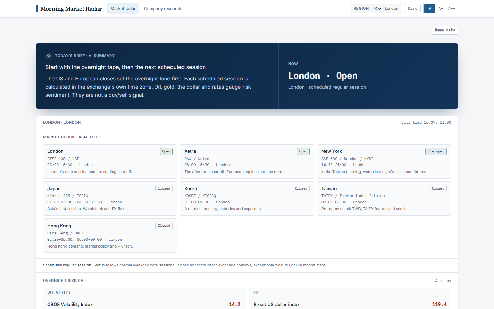
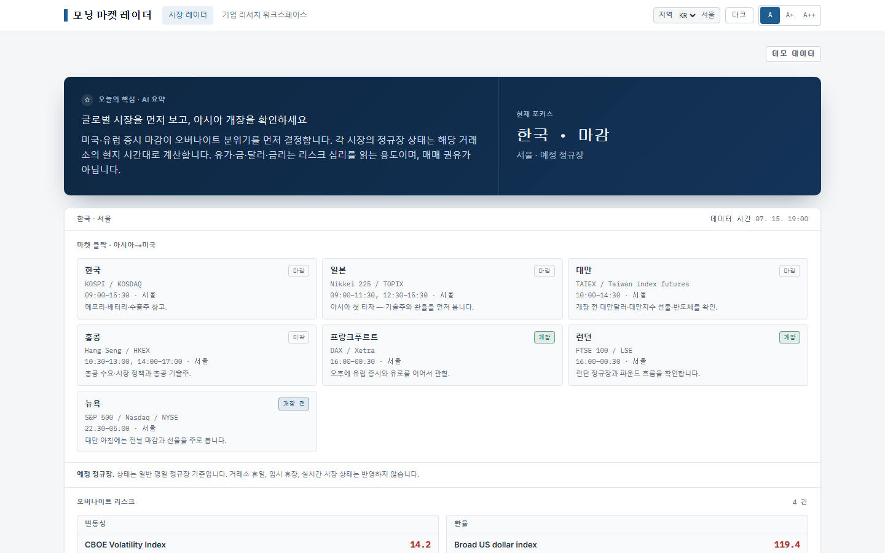
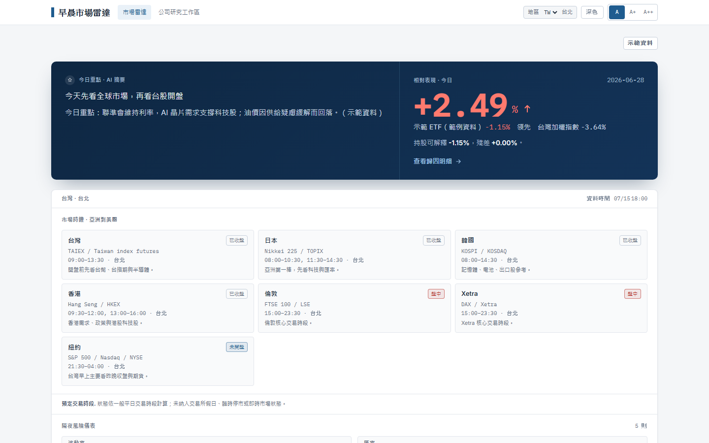
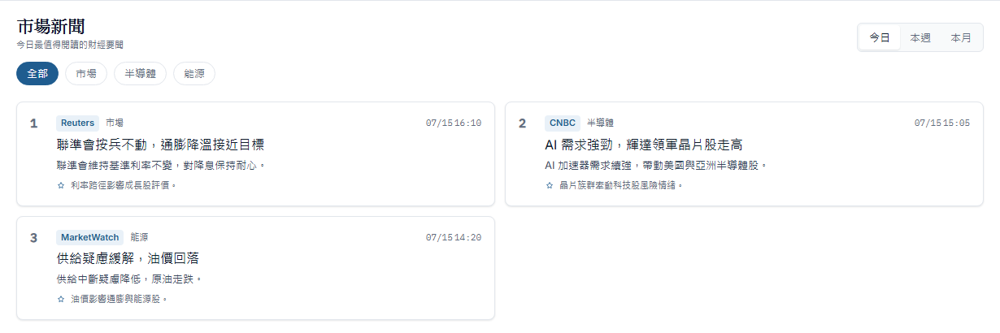

# Morning Market Radar — the `/` route

The second of this project's two surfaces. It is a region-aware scanning view of
the trading day, built on the same connectors and the same source-boundary rules
as the cited company brief at `/`, but with a different job: the brief is read
carefully once, the radar is glanced at.

The citation validation work that the repository exists to demonstrate lives on
the `/brief` route. See the [README](../README.md) for that, and
[`EVAL_METHODOLOGY.md`](EVAL_METHODOLOGY.md) for how it is measured.

## What it shows

- **Four editions**, selected with `?region=tw|kr|uk|eu`. A valid URL value wins
  over the saved preference; otherwise the app uses local storage, then the
  edition chooser.
- **A typed Traditional Chinese, Korean and English catalogue** for the radar
  shell, categories, controls, market labels and limitations.
- **Seven scheduled regular/core sessions** — Japan, Korea, Taiwan, Hong Kong,
  London, Xetra and New York. Each is calculated in its exchange's IANA time zone
  and displayed in Taipei, Seoul, London or Brussels time for the chosen edition.
- **A sourced global overnight-risk rail and finance-news feed.** Korea, UK and
  EU localise that existing global coverage; they do not claim complete
  local-market feeds.
- **Taiwan-only USD/TWD context and ETF-versus-TAIEX attribution.** These modules
  are not implied for other regions.
- **One cached news-translation batch** for Traditional Chinese and Korean. If no
  suitable model key is configured, the English source text stays visible and is
  marked as original-language content.

## What the session clock does not do

The clock is schedule-derived. It handles local weekdays and daylight-saving
changes. It does **not** account for exchange holidays, exceptional closures or
live market state.

## Regional scope, without overclaiming

| Edition | Interface and clock | Data scope |
| --- | --- | --- |
| Taiwan | Traditional Chinese; Taipei time | Global radar plus Taiwan-specific USD/TWD and ETF attribution |
| Korea | Korean; Seoul time | Localised view of the sourced global radar |
| UK | English; London time | Localised view of the sourced global radar |
| EU | English; Brussels time | Localised view of the sourced global radar |

Published session hours are checked against the exchanges' primary
documentation. The exact sources, public wording and retained tests are in the
[public claim ledger](claims/claim-ledger.md).

## On the translated editions

The Traditional Chinese and Korean interface strings are a typed catalogue —
written, reviewed and committed, not generated at runtime.

The translated **news summaries** are different: they are model output, and
**nothing checks them at all.** No measurement exists of their fidelity to the
English source, and none of the automatic checks described below run on them.

This is the weaker of the project's two translation paths, and the gap is worth
stating plainly. The translated **company brief** does get automatic structure
and citation checks — section count and order, every citation marker still in its
own section, no figure the English draft never stated — and a translation that
fails one is marked for review. Those checks are reached only from the brief
path; `translate_news_items` here calls none of them.

Neither path evaluates wording, on the brief or on the radar. Structure is not
meaning, and a translated claim can still lose the support its citation gave it
in English.

## Captures

These come from the deterministic demo build, after the full test and
accessibility gates passed. The route captures are 1440×900.

| UK radar | Korea radar |
| --- | --- |
|  |  |



Static, repeatable Taiwan news capture:



To reproduce these images after a verified demo-mode build:

```bash
cd frontend
npm run capture:readme
```
