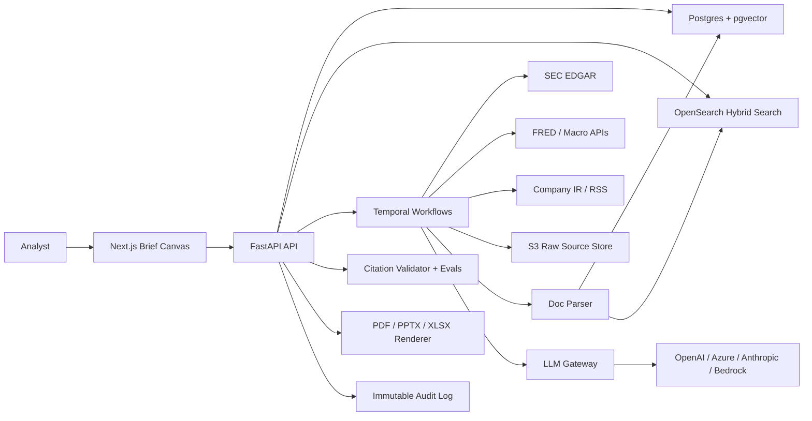

# Cited Market Brief Agent: Production Development Plan

Current as of 2026-06-05.

## 1. Product Thesis

Do not build a Bloomberg, FactSet, LSEG Workspace, or AlphaSense clone. Those platforms win on licensed data, real-time coverage, entitlements, Excel workflows, distribution, and institutional trust.

Build a narrower workflow product:

> An audit-ready public-data brief engine for investment research teams.

The product should turn public filings, macro releases, company investor-relations material, public datasets, and licensed-by-user sources into a cited, reviewable morning brief. The attention-grabbing wedge is not more charts. It is defensible source provenance, change detection, and exportable research artifacts that an analyst can trust, edit, and reuse.

## 2. Target User and Use Case

### Primary users

- Asset-management research analysts
- Market-intelligence analysts
- Sector specialists
- Investment-product and strategy teams
- Finance professionals who already have terminals but still prepare recurring notes manually

### First workflow to own

Morning public-market brief for a user-defined watchlist:

1. User defines tickers, sectors, macro themes, and preferred brief template.
2. System checks what changed since the last run.
3. System retrieves public sources and licensed-by-user sources.
4. System generates an evidence-backed brief.
5. System flags unsupported claims and conflicting sources.
6. User reviews, edits, approves, and exports to Markdown, PDF, PPTX, DOCX, XLSX, and citation manifest.

### Positioning

Use:

- "Audit-ready public-data brief engine"
- "Cited public-source research assistant"
- "Evidence ledger for analyst briefs"

Avoid:

- "Bloomberg replacement"
- "AI trading terminal"
- "Autonomous analyst"
- "Buy/sell recommender"
- "AI-powered alpha engine"

## 3. What Will Catch Professional Attention Now

Major finance platforms already market AI search, document analysis, and workflow automation. Bloomberg describes conversational AI and AI document/news summaries for Terminal users. FactSet markets generative-AI document and transcript workflows. LSEG markets AI-enabled workflow and Microsoft integration. AlphaSense emphasizes trusted content and sentence-level citations.

Therefore the product must look professional in the areas analysts currently care about:

- Sentence-level citations with exact source spans
- Evidence ledger for every material claim
- "What changed since yesterday" and "what changed since last meeting"
- Filing and risk-factor diffs
- Macro-release deltas with data vintage awareness
- Reusable analyst templates
- Editable PPTX/XLSX exports, not just chat responses
- Unsupported-claim and stale-source checks
- Human review and approval before external use
- Public-source licensing and fair-access controls
- No investment advice or portfolio personalization

## 4. MVP Scope

### In scope

- US public equities watchlists
- Public-company filings through SEC EDGAR
- Public macro series through FRED
- Optional BLS, BEA, Census, company IR feeds, and official RSS feeds
- Daily brief generation
- Source ingestion, parsing, chunking, search, and citation storage
- Evidence ledger UI
- Brief canvas UI
- Feedback buttons: useful, not useful, wrong, needs source
- Exports: Markdown, PDF, PPTX, XLSX, JSON citation manifest
- Compliance disclaimers and advice-boundary guardrails
- Audit logs for prompts, sources, model calls, outputs, citations, exports, and approvals

### Out of scope for MVP

- Real-time market-data terminal
- Trading execution
- Buy/sell/hold recommendations
- Portfolio suitability or client-specific advice
- Broker research ingestion
- JPM or employer-internal data
- Scraping content behind terminals, broker portals, paywalls, or login pages
- Publicly redistributing restricted third-party data

## 5. Recommended Production Tech Stack

### Product architecture

- Frontend: Next.js, React, TypeScript
- Backend API: Python, FastAPI, Pydantic, SQLAlchemy or SQLModel
- Database: PostgreSQL with pgvector
- Search: OpenSearch or Elasticsearch for hybrid BM25 plus vector retrieval
- Raw object storage: S3-compatible object store
- Workflows: Temporal for durable ingestion, parsing, brief generation, and export jobs
- Queue/cache: Redis where useful for short-lived cache, rate limits, and job coordination
- LLM gateway: LiteLLM or a thin internal provider abstraction
- LLM providers: OpenAI, Azure OpenAI, Anthropic or Bedrock as configurable providers
- Parsing: Docling or Unstructured for PDFs/HTML/filings, with table and page metadata preserved
- Rendering: HTML/CSS report model to PDF with Playwright or WeasyPrint
- PPTX: PptxGenJS or python-pptx with editable slide templates
- XLSX: openpyxl or equivalent with raw-data, source, and formula tabs
- Observability: OpenTelemetry for traces, metrics, logs; Langfuse or LangSmith for LLM traces and evals
- CI/CD: GitHub Actions, Docker Buildx, Terraform/OpenTofu or AWS CDK
- Cloud default: AWS ECS/Fargate, RDS Postgres, OpenSearch Serverless, S3, Secrets Manager, CloudWatch

### Why not Streamlit as the main app

Streamlit is good for prototypes and internal analyst/admin panels. The main product needs production authentication, organization workspaces, review workflows, exports, audit trails, responsive UI, and permissioned source controls. Use Next.js for the real user surface and Streamlit only as an internal lab if useful.

## 6. System Architecture



## 7. Core Data Model

Minimum tables/entities:

- `organizations`: tenant, plan, retention policy
- `users`: identity, role, MFA status, org membership
- `watchlists`: tickers, sectors, macro themes, schedule
- `entities`: ticker, CIK, LEI, exchange, sector, aliases
- `sources`: URL, publisher, source type, license, access method, retrieved timestamp, checksum
- `documents`: source ID, document type, filing accession, publication date, version, raw object pointer
- `chunks`: document ID, page, section, paragraph/table coordinates, text, embedding, lexical fields
- `time_series`: series ID, provider, units, frequency, vintage, observations
- `claims`: brief ID, claim text, claim type, confidence, support status
- `citations`: claim ID, chunk ID, exact span, source URL, evidence quote/snippet, validator status
- `briefs`: template, watchlist, generated draft, user edits, status, approvals
- `exports`: format, file pointer, reviewer, generated timestamp
- `feedback`: useful, wrong, needs source, free-text note
- `audit_events`: actor, action, object, model/provider/version, prompt version, source IDs, policy flags
- `eval_runs`: dataset, prompt version, model version, scores, failures

## 8. Deterministic Citation Pipeline

Do not rely on the model to invent citations after generation. Own citations in the application layer.

1. Ingest source with URL, publisher, license, retrieval time, checksum, and raw file pointer.
2. Parse into structure-aware chunks with page, table, heading, section, paragraph, and character/span metadata.
3. Store raw document separately from normalized chunks.
4. Index chunks in both Postgres/pgvector and OpenSearch.
5. Retrieve using hybrid search with filters for ticker, CIK, filing type, publication date, source type, and geography.
6. Rerank retrieved chunks.
7. Generate from an evidence pack, requiring structured JSON output:

```json
{
  "brief_sections": [],
  "claims": [
    {
      "text": "string",
      "claim_type": "filing_change | macro_delta | risk | catalyst | factual_summary",
      "citations": ["source_span_id"],
      "confidence": "high | medium | low",
      "needs_review": false
    }
  ],
  "unsupported_claims": [],
  "open_questions": []
}
```

8. Validate each claim has at least one citation to a stored source span.
9. Validate numeric claims against extracted tables/time series where possible.
10. Remove, downgrade, or flag claims that fail validation.
11. Save the final evidence ledger with the exported report.

## 9. Source Strategy

### MVP public sources

- SEC EDGAR filings and company facts
- FRED macroeconomic series
- Federal Reserve releases where relevant
- BLS, BEA, and Census APIs for official economic data
- Company IR pages and RSS feeds where terms allow
- Official exchange or company calendars where terms allow

### Paid or licensed sources later

- Nasdaq Data Link, Polygon, Tiingo, Alpha Vantage, or other market-data APIs
- Customer-provided licensed datasets only when contractually permitted
- Enterprise connectors for documents the customer has rights to upload

### Rules

- Maintain source allowlists.
- Store source license and terms notes.
- Do not scrape terminal content, broker research, private client data, or employer-internal data.
- Respect robots.txt, rate limits, and API terms.
- For SEC EDGAR, use a declared user agent and keep requests within fair-access limits.

## 10. Security, Privacy, and Compliance Plan

This is not legal advice. It is the engineering launch posture that should be reviewed by counsel before any professional or commercial deployment.

### Advice boundary

The product must be factual, cited, and non-personalized.

Block, refuse, or route to review prompts that ask for:

- Buy/sell/hold recommendations
- Portfolio-specific advice
- Suitability language
- Personalized allocation
- Security ranking based on a user's goals or risk tolerance
- Unqualified target prices
- Promissory or performance-guarantee language

### Regulated communications

Generated briefs may become regulated communications if a broker-dealer, RIA, or representative uses them externally. Required controls:

- "Internal research draft" watermark before approval
- Export review step
- Approval audit trail
- Fair and balanced language checks
- Risk/caveat sections
- No testimonials, endorsements, third-party ratings, or performance claims without compliance workflow

### Privacy

Even public-data tools process personal data once user accounts, prompts, annotations, and usage logs are stored.

Minimum controls:

- Privacy notice
- Terms of use
- Data processing addendum template
- Retention schedule by data category
- Deletion and export workflow
- DSAR process for GDPR/UK GDPR/CCPA-style requests
- Data minimization in prompts and logs
- Configurable tenant retention
- No vendor training on customer inputs or outputs unless explicitly opted in and contracted
- Subprocessor list and vendor DPAs

### Security baseline

Build toward SOC 2-style controls from day one:

- SSO/SAML or OIDC for teams
- MFA for admins
- RBAC and least privilege
- Secrets Manager, no plaintext secrets in repo
- Encryption in transit and at rest
- Quarterly access reviews
- Centralized audit logs
- Vulnerability scanning
- Dependency scanning
- Secure SDLC with code review and CI checks
- Backups and restore tests
- Incident response plan
- Vendor risk review
- Environment separation: dev, staging, production

### LLM security

Map controls to OWASP LLM risks:

- Prompt-injection tests on filings, PDFs, and web pages
- Source isolation and allowlisted tools
- No unrestricted browsing tools for production agents
- Output sanitization before HTML/PDF/PPTX rendering
- Strict structured output schemas
- Citation validation
- Tool permission scoping
- Rate and cost limits
- Model/provider version logging
- Red-team prompt suite
- Human approval for externally shared exports

### Launch no-go gates

Do not launch commercially if any of these are unresolved:

- No privacy notice, retention schedule, or deletion workflow
- No LLM/vendor data-use review
- No EDGAR fair-access user agent and rate limit
- No citation validator
- No audit log for prompts, sources, outputs, and exports
- No advice-boundary guardrails
- No review flow for client-facing exports
- No source licensing policy
- No incident response process

## 11. Evaluation and Quality Metrics

### Product metrics

- Time saved per brief
- Percentage of claims with validated citations
- Analyst edit distance from generated draft to approved brief
- Unsupported-claim rate
- Wrong-source feedback rate
- User approval rate per brief section
- Source freshness at generation time
- Export success rate

### RAG and citation metrics

- Citation precision: cited source supports the claim
- Citation recall: all material claims have citations
- Numeric accuracy: values match source tables/time series
- Retrieval relevance: retrieved chunks match analyst intent
- Freshness: latest available filing/release included
- Contradiction detection: conflicting public sources surfaced
- Hallucination rate: unsupported claims per 1,000 words

### Eval datasets

Create fixed eval suites:

- 10-K risk-factor change detection
- 10-Q earnings highlights
- 8-K event extraction
- FRED macro release delta
- Multi-source contradiction test
- Prompt-injection source document test
- Export citation manifest consistency test

Run evals in CI before prompt/model changes are promoted.

## 12. Development Roadmap

### Phase 0: Product and governance foundation, 1 week

Deliverables:

- Final target user and non-goals
- Source policy
- Advice-boundary policy
- Privacy and retention draft
- Initial architecture decision record
- Brief template examples
- Eval dataset seed list

Exit criteria:

- MVP scope frozen
- Launch no-go gates accepted
- Source allowlist approved

### Phase 1: Local vertical slice, 2 weeks

Deliverables:

- FastAPI project skeleton
- Next.js app skeleton
- Postgres schema and migrations
- SEC and FRED connector prototypes
- Raw source storage abstraction
- Structure-aware parser prototype
- Watchlist CRUD
- One generated brief for 3 to 5 tickers

Exit criteria:

- User can create a watchlist and generate a cited Markdown brief
- Every claim links to stored source metadata
- Basic audit events recorded

### Phase 2: Evidence ledger and citation validator, 2 weeks

Deliverables:

- `sources`, `documents`, `chunks`, `claims`, `citations` tables
- Hybrid retrieval prototype
- Citation validator
- Unsupported-claim flags
- Evidence ledger UI
- Feedback buttons
- Initial eval suite

Exit criteria:

- 95 percent or more of material claims in seeded briefs have citations
- Unsupported generated claims are flagged before export
- Analyst can inspect exact evidence source from UI

### Phase 3: Change detection and analyst UX, 2 weeks

Deliverables:

- Filing change detection
- Macro time-series delta detection
- Risk-factor diff view
- Brief canvas with editable sections
- Watchlist schedules
- "Since last brief" run comparison

Exit criteria:

- System can produce "what changed since last brief"
- User can accept, edit, reject, or request more source support per section

### Phase 4: Exports and review workflow, 2 weeks

Deliverables:

- PDF export
- PPTX export with editable slides
- XLSX export with raw-data and source tabs
- JSON citation manifest
- Review and approval states
- Internal-draft watermark before approval

Exit criteria:

- Approved brief exports consistently
- Citation manifest matches exported claims
- Audit trail records reviewer and export event

### Phase 5: Production hardening, 2 to 3 weeks

Deliverables:

- Authentication and RBAC
- Tenant isolation
- Secrets management
- Rate limiting and source-specific quotas
- OpenTelemetry instrumentation
- LLM trace/eval observability
- CI checks: tests, lint, dependency scan, eval gate
- Docker Compose for local dev
- Staging deployment
- Backup and restore test
- Incident response draft

Exit criteria:

- Staging environment supports realistic end-to-end runs
- Security checklist has no launch-blocking gaps
- Eval scores meet agreed threshold

### Phase 6: Pilot with domain user, 2 weeks

Deliverables:

- 2 to 3 real watchlist templates
- Daily morning brief pilot
- Feedback capture
- Error review log
- Product demo deck
- Case-study style results using public data only

Exit criteria:

- Domain user says at least one recurring brief is genuinely useful
- Top failure modes are documented
- Demo is credible for fintech, asset-management, market-intelligence, and RAG roles

## 13. Team and Agent Workstreams

### Product agent

Owns:

- Analyst workflows
- Brief templates
- UX acceptance criteria
- Competitive positioning
- User interview script

### Data engineering agent

Owns:

- SEC/FRED/BLS/BEA connectors
- Rate limits and caching
- Entity resolution
- Raw source storage
- Time-series normalization

### RAG and evaluation agent

Owns:

- Parsing, chunking, embeddings, retrieval
- Citation validator
- Claim schemas
- Eval datasets and CI gates
- Hallucination and unsupported-claim metrics

### Frontend agent

Owns:

- Brief canvas
- Evidence ledger UI
- Watchlist setup
- Review and approval flow
- Export controls

### Platform and security agent

Owns:

- Auth, RBAC, audit logs
- Tenant isolation
- Deployment
- Observability
- Secrets and CI/CD
- Security checklist

### Compliance and policy agent

Owns:

- Advice-boundary prompts and refusals
- Source policy
- Privacy and retention policy
- Export review requirements
- Disclaimers and launch no-go gates

## 14. First Build Backlog

### Week 1

- Create monorepo or service layout
- Add FastAPI app, Next.js app, Postgres, Docker Compose
- Define schema migrations
- Implement SEC connector with declared user agent and rate limit
- Implement FRED connector with API-key configuration
- Create source metadata model
- Draft privacy, source, and advice-boundary policies

### Week 2

- Parse SEC filing HTML into sections and chunks
- Store raw source and checksum
- Add embeddings and pgvector
- Add OpenSearch local or managed prototype
- Generate first structured cited brief
- Add audit log events for ingestion and generation

### Week 3

- Build evidence ledger UI
- Add claim and citation tables
- Add citation validator
- Add unsupported-claim handling
- Add feedback buttons
- Create first eval dataset

### Week 4

- Add filing diff and macro delta
- Build editable brief canvas
- Add watchlist run history
- Add PDF export
- Add JSON citation manifest

### Week 5

- Add PPTX and XLSX exports
- Add approval workflow
- Add auth and RBAC
- Add source policy enforcement
- Add CI eval gate

### Week 6

- Deploy staging
- Add observability and LLM traces
- Run backup/restore test
- Run security and prompt-injection tests
- Pilot daily brief
- Produce demo deck and README

## 15. Demo That Will Impress

Build a demo around a real public-data scenario:

- Watchlist: 5 public companies in one sector plus 5 macro series
- Brief title: "What changed since yesterday?"
- Sections:
  - Market and macro context
  - Filing changes
  - Company-specific developments
  - Risks and watch items
  - Evidence ledger
  - Unsupported or low-confidence claims
  - Analyst open questions
- Export:
  - PPTX morning-meeting slide pack
  - XLSX source workbook
  - PDF memo
  - JSON citation manifest

The key demo moment should be clicking a claim and showing the exact SEC filing section, table, macro series, source timestamp, and validation status behind it.

## 16. Source and Standards Anchors

Product and market context:

- Bloomberg AI for finance: https://professional.bloomberg.com/products/bloomberg-terminal/ai/
- FactSet AI: https://www.factset.com/ai
- LSEG Workspace: https://www.lseg.com/en/data-analytics/products/workspace
- AlphaSense market intelligence: https://www.alpha-sense.com/

Public data:

- SEC EDGAR access and fair access: https://www.sec.gov/edgar/searchedgar/accessing-edgar-data.htm
- SEC EDGAR APIs: https://www.sec.gov/search-filings/edgar-application-programming-interfaces
- FRED API overview: https://fred.stlouisfed.org/docs/api/fred/overview.html
- FRED API terms: https://fred.stlouisfed.org/docs/api/terms_of_use.html
- Nasdaq Data Link docs: https://docs.data.nasdaq.com/

Stack:

- FastAPI deployment: https://fastapi.tiangolo.com/deployment/
- FastAPI full-stack template: https://fastapi.tiangolo.com/project-generation/
- Uvicorn deployment: https://www.uvicorn.org/deployment/
- pgvector: https://github.com/pgvector/pgvector
- OpenTelemetry docs: https://opentelemetry.io/docs/
- SQLAlchemy 2.0 docs: https://docs.sqlalchemy.org/en/20/
- Pydantic settings: https://docs.pydantic.dev/latest/api/pydantic_settings/

Security, privacy, and governance:

- OWASP LLM Top 10: https://owasp.org/www-project-top-10-for-large-language-model-applications
- OWASP ASVS: https://owasp.org/www-project-application-security-verification-standard/
- NIST AI RMF: https://www.nist.gov/itl/ai-risk-management-framework
- EU AI Act: https://digital-strategy.ec.europa.eu/en/policies/regulatory-framework-ai
- GDPR principles: https://commission.europa.eu/law/law-topic/data-protection/rules-business-and-organisations/principles-gdpr_en
- UK ICO data protection principles: https://ico.org.uk/for-organisations/uk-gdpr-guidance-and-resources/data-protection-principles/a-guide-to-the-data-protection-principles/
- California CCPA regulations: https://oag.ca.gov/privacy/ccpa/regs
- FINRA Rule 2210: https://www.finra.org/rules-guidance/rulebooks/finra-rules/2210
- FINRA 2026 GenAI oversight topic: https://www.finra.org/rules-guidance/guidance/reports/2026-finra-annual-regulatory-oversight-report/gen-ai
- SEC Investment Adviser Marketing: https://www.sec.gov/investment/investment-adviser-marketing
- AICPA Trust Services Criteria: https://www.aicpa-cima.com/resources/download/2017-trust-services-criteria-with-revised-points-of-focus-2022

## 17. Decision Summary

Build this as a separate production project. The strongest version is not an AI terminal; it is a trusted, cited, public-source research workflow that makes analysts faster without pretending to replace their professional data stack. The first production goal is a daily, editable, evidence-backed morning brief that survives scrutiny from an analyst, a compliance reviewer, and an engineer.
