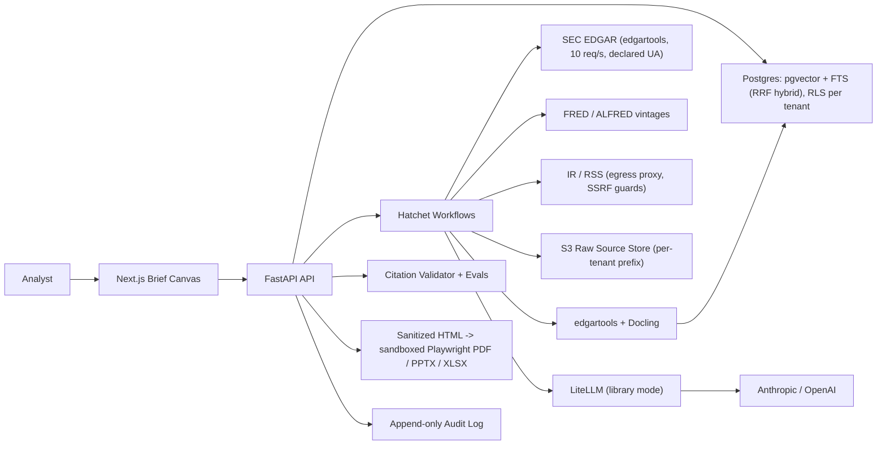

# LedgerBrief — Production Development Plan (v2)

Current as of 2026-06-10. Supersedes `PRODUCTION_DEVELOPMENT_PLAN.md` (2026-06-05); revisions driven by `EVALUATION_REPORT.md`.

## 1. Product Thesis

Do not build a Bloomberg, FactSet, LSEG, or AlphaSense clone — and do not compete on "AI with citations" either. As of 2026 all four incumbents ship agentic AI with source attribution (Bloomberg ASKB, FactSet/Finster, LSEG×Microsoft agents, AlphaSense Deep Research), and venture-backed entrants (Rogo, Fintool, Hebbia, Brightwave) all cite sources. Citations are table stakes.

Build what none of them sell:

> An audit-ready public-data brief engine — deterministic claim→span validation, an exportable evidence ledger, FINRA-aligned audit trails, and change detection with data-vintage awareness.

LedgerBrief turns public filings, macro releases, and IR material into a cited, reviewable morning brief whose every material claim is validated in the application layer against a stored source span, and ships the proof as an artifact (JSON citation manifest) alongside the brief. The wedge is verifiability you can hand to a compliance reviewer, not chat.

## 2. Target User and First Workflow

Primary users: asset-management research analysts, market-intelligence analysts, sector specialists, strategy teams — professionals who have terminals but still prepare recurring notes manually.

First workflow: morning public-market brief for a user-defined watchlist.

1. User defines tickers, sectors, macro themes, brief template.
2. System detects what changed since the last run (filings, macro vintages).
3. System retrieves public + licensed-by-user sources.
4. System generates an evidence-backed brief from an evidence pack.
5. System flags unsupported claims and conflicting sources.
6. User reviews, edits, approves, exports (Markdown, PDF, PPTX, XLSX, JSON citation manifest).

Positioning: "audit-ready public-data brief engine", "evidence ledger for analyst briefs". Never: "Bloomberg replacement", "AI trading terminal", "autonomous analyst", "buy/sell recommender".

## 3. MVP Scope

In scope: US public equities watchlists; SEC EDGAR filings; FRED macro series (optional BLS/BEA/Census/IR RSS); daily brief generation; ingestion → parsing → chunking → hybrid retrieval → citation storage; evidence ledger UI; brief canvas; feedback buttons; exports (MD/PDF/PPTX/XLSX/JSON manifest); compliance disclaimers and advice-boundary guardrails; audit logs for prompts, sources, model calls, outputs, citations, exports, approvals.

Out of scope: real-time market data, trading execution, buy/sell/hold recommendations, portfolio suitability, broker research ingestion, employer-internal data, scraping behind logins/paywalls, redistributing restricted data, extracted/hypothetical performance presentation.

## 4. Tech Stack (decided — no open "or"s)

| Layer | Choice | Pin |
|---|---|---|
| Frontend | Next.js (App Router, RSC, Cache Components) + React + TypeScript | Next 16.2.x LTS, React 19.2.x, TS 5.x |
| Styling/components | Tailwind CSS v4 + shadcn/ui (vendored) + TanStack Table v8 | — |
| Charts | TradingView lightweight-charts v5 (attribution required) + Recharts 3.x | — |
| API | Python + FastAPI + Pydantic v2 | Python 3.13, FastAPI ≥0.136, Pydantic ≥2.13 |
| ORM/migrations | SQLAlchemy 2.0 + Alembic | 2.0.x |
| Database | PostgreSQL + pgvector (HNSW, halfvec) | PG 18.x, pgvector ≥0.8.2 (CVE-2026-3172) |
| Hybrid search | Postgres FTS + pgvector with RRF fusion (no OpenSearch at MVP) | — |
| Object storage | S3-compatible (MinIO local) | — |
| Workflows | Hatchet (Postgres-backed, MIT). Fallback: Temporal Cloud | — |
| Cache/queue | Valkey | 8.x |
| LLM gateway | LiteLLM in library mode, hash-pinned | ≥1.88.1 (supply-chain incident in 1.82.7/8) |
| LLM providers | Anthropic + OpenAI (two only at MVP) | — |
| Parsing | edgartools (EDGAR HTML/XBRL) + Docling (IR PDFs) | latest |
| Rendering | Playwright PDF (sandboxed: JS + network disabled) · python-pptx · openpyxl | — |
| Observability | OpenTelemetry (GenAI semconv behind own wrapper) + Langfuse | — |
| CI/CD | GitHub Actions (SHA-pinned), Docker Buildx, Terraform/OpenTofu | — |
| Cloud | AWS ECS/Fargate, RDS Postgres, S3, Secrets Manager, ElastiCache (Valkey), CloudWatch | — |

Notes: Next 16 renames `middleware.ts` → `proxy.ts`; Turbopack is the default build. No Streamlit user surface. OpenSearch re-enters only if retrieval-relevance evals prove Postgres FTS insufficient.

## 5. System Architecture

## 6. Core Data Model

`organizations` (tenant, plan, retention) · `users` (identity, role, MFA status) · `watchlists` · `entities` (ticker, CIK, LEI, aliases) · `sources` (URL, publisher, license, access method, retrieved_at, checksum) · `documents` (source, type, accession, pub date, version, raw pointer) · `chunks` (document, page/section/span coords, text, embedding, FTS vector) · `time_series` (provider, units, frequency, **vintage**, observations) · `claims` (brief, text, type, confidence, support status) · `citations` (claim, chunk, exact span, evidence quote, validator status) · `briefs` (template, draft, edits, status, approvals) · `exports` (format, pointer, reviewer, timestamp) · `feedback` · `audit_events` (actor, action, object, model/provider/version, prompt version, source IDs, policy flags) · `eval_runs`.

All org-scoped tables carry `org_id` with **Postgres Row-Level Security** enforced via session variable. Vector and FTS queries inherit RLS — never query-side filtering alone.

## 7. Deterministic Citation Pipeline

Own citations in the application layer; never let the model invent them post hoc.

1. Ingest source with URL, publisher, license, retrieval time, checksum, raw pointer.
2. Parse into structure-aware chunks (page, table, heading, section, char-span metadata).
3. Store raw document separately from normalized chunks.
4. Index chunks once, in Postgres: pgvector (HNSW) + tsvector FTS.
5. Retrieve via RRF-fused hybrid search filtered by ticker, CIK, filing type, date, source type.
6. Rerank retrieved chunks.
7. Generate from an evidence pack with strict structured JSON output: `brief_sections`, `claims[{text, claim_type, citations[source_span_id], confidence, needs_review}]`, `unsupported_claims`, `open_questions`.
8. Validate every claim has ≥1 citation to a stored span; validate numeric claims against extracted tables/series.
9. Remove, downgrade, or flag failures.
10. Persist the evidence ledger with the export; emit JSON citation manifest.

Untrusted source text is spotlighted/delimited in prompts; generation runs in a quarantined context with no tool access (indirect-prompt-injection architecture, not just tests).

## 8. Source Strategy

MVP: SEC EDGAR (filings + company facts), FRED/ALFRED, Fed releases, BLS/BEA/Census, IR pages and RSS where terms allow. Later: Nasdaq Data Link, Polygon, Tiingo; customer-licensed datasets when contractually permitted.

Rules: source allowlists enforced at fetch time; license/terms stored per source; respect robots.txt and rate limits; EDGAR declared User-Agent, ≤10 req/s; non-government sources land in a quarantine tier (RAG-poisoning control) before promotion; FRED attribution in exports; no scraping behind logins.

## 9. Security, Privacy, and Compliance

Engineering posture for counsel review; not legal advice.

### Advice boundary
Block/refuse/route-to-review: buy/sell/hold recommendations, portfolio advice, suitability language, personalized allocation, goal-based rankings, unqualified target prices, promissory language, extracted/hypothetical performance presentation.

### Regulated communications
"Internal research draft" watermark pre-approval; export review step; approval audit trail; fair-and-balanced checks; risk/caveat sections; no testimonials/ratings without compliance workflow. FINRA 2026 expectations: pre-deployment compliance assessment, GenAI governance in WSPs, hallucination controls, books-and-records retention of AI outputs.

### EU AI Act (Art. 50, applies 2026-08-02)
Outputs carry machine-readable AI-generated marking; provenance metadata embedded in PDF/PPTX/JSON exports. The human review + editorial-responsibility approval flow is the Art. 50(4) exemption asset — keep it mandatory. Product is limited-risk (Annex III high-risk deadlines deferred to Dec 2027+ by May 2026 omnibus); document the classification.

### Privacy
Privacy notice, ToU, DPA template, retention schedule by category, deletion/export workflow, DSAR process (GDPR/UK GDPR/CCPA), data minimization in prompts/logs, configurable tenant retention, no vendor training on customer data unless opted in, subprocessor list + DPAs.

### Security baseline (ASVS 5.0: L2 app-wide; L3 for authn, session, authz/multi-tenancy, audit logging)
- AuthN: OIDC Authorization Code + PKCE; MFA default-on for all users, WebAuthn for admins; SSO/SAML + SCIM deprovisioning (≤24h); short-lived tokens; hashed per-tenant API keys; HMAC-signed webhooks; short-expiry signed export URLs.
- Tenant isolation: Postgres RLS everywhere; per-tenant S3 prefixes with IAM conditions; cross-tenant leakage test in CI.
- SSRF (IR/RSS fetchers): fetch-time allowlist; DNS resolution rejecting private/link-local ranges incl. 169.254.169.254 with rebinding protection; egress proxy in isolated subnet; IMDSv2-only; capped redirects re-validated per hop.
- Output safety: server-side allowlist sanitization (nh3) + DOMPurify; nonce-based CSP; sandboxed Playwright (JS/network off) for PDF; XLSX formula-injection escaping (`= + - @`); strip remote-image exfiltration channels.
- Supply chain: lockfiles + hash-pinned deps, SHA-pinned Actions, CycloneDX SBOM per release, cosign-signed images, dependency + vuln scanning.
- Plus: RBAC/least privilege, Secrets Manager, encryption in transit/at rest, quarterly access reviews, centralized audit logs, secure SDLC, backups + restore tests, IR plan, vendor risk review, dev/staging/prod separation.

### LLM security (OWASP LLM Top 10 — 2025)
LLM01 prompt-injection: architectural separation + red-team suite incl. poisoned filings/PDFs/RSS. LLM02: output-side PII/secret filtering on briefs and logs. LLM04: source quarantine tier + corpus integrity checks. LLM05: sanitization before any rendering. LLM06: allowlisted tools, no unrestricted browsing. LLM07: system prompts treated as non-secret + leakage tests. LLM08: RLS-inherited vector search, no cross-tenant embeddings. LLM09: citation validator + human approval. LLM10: rate + cost limits per tenant. Model/provider/version logged on every call.

### Launch no-go gates
Original: privacy notice/retention/deletion; LLM vendor data-use review; EDGAR fair-access UA + rate limit; citation validator; audit log; advice-boundary guardrails; export review flow; source licensing policy; incident response.
Added: cross-tenant isolation test passes (RLS + vector + S3); SSRF egress controls verified against metadata/internal endpoints; sanitization + CSP + formula-escaping verified, PDF renderer sandboxed; MFA enforced, OIDC+PKCE, 24h offboarding; EU AI Act Art. 50 marking in exports (if EU users); SBOM per release, deps/Actions pinned; external pen test + injection/poisoning red-team pass; SOC 2 Type I evidence set complete.

## 10. Design System (JPM-grade)

Derived from Salt — JPMorgan Chase's open-source design system — using published `@salt-ds/theme` token values. Full spec: `docs/DESIGN_SYSTEM.md`.

- Palette: navy #00477B (brand), action blue #2670A9, dark surfaces #161616/#242526/#2A2C2F, light neutrals #E0E4E9→#84878E; semantic up/down #24874B/#E32B16 (light), #309C5A/#ED412A (dark) — always paired with ▲/▼ and signs; amber #EA7319 for flagged claims.
- Type: Inter (UI/data, tabular-nums), Source Serif 4 (brief headlines), IBM Plex Mono (tickers/CIKs/accessions/timestamps). Body 13–14px; medium density default, high density in the evidence ledger.
- Tables: right-aligned tabular numerals, ruled hairlines (no zebra), 32px rows, sticky uppercase 11px headers, signed colored deltas with glyphs.
- Radii 0/4/8px; 1px borders over shadows on dark; WCAG 2.2 AA (focus not obscured, ≥24px targets, reduced motion).

### Performance budgets (CI-enforced)
p75: LCP ≤2.5s, INP ≤200ms, CLS ≤0.1. Initial route JS ≤200KB gzipped; charts lazy-loaded; fonts ≤100KB self-hosted via next/font. RSC-first; Cache Components with `use cache` + `cacheTag` per watchlist-run; Suspense skeletons matching final layout; streamed brief generation section-by-section with citation chips appearing as validated; fixed-height claim rows (no shift while streaming); optimistic UI on approve/edit/feedback.

## 11. Evaluation and Quality Metrics

Product: time saved per brief; % claims with validated citations; analyst edit distance; unsupported-claim rate; wrong-source feedback rate; approval rate per section; source freshness; export success rate.

RAG/citation: citation precision and recall; numeric accuracy vs source tables/series; retrieval relevance; freshness; contradiction detection; hallucination rate per 1,000 words.

Fixed eval suites (run in CI before prompt/model promotion): 10-K risk-factor change detection; 10-Q earnings highlights; 8-K event extraction; FRED macro delta (vintage-aware); multi-source contradiction; prompt-injection source document; RAG-poisoning resistance; export citation-manifest consistency; cross-tenant leakage.

## 12. Roadmap

- **Phase 0 — Foundation (1 wk)**: scope freeze, source policy, advice-boundary policy, privacy draft, ADRs, brief templates, eval seed list, EU AI Act classification note. *Exit: no-go gates accepted, allowlist approved.* ✅ (this document set)
- **Phase 1 — Local vertical slice (2 wks)**: FastAPI + Next.js skeletons, Postgres schema + Alembic, SEC/FRED connectors, raw storage abstraction, parser prototype, watchlist CRUD, one cited brief for 3–5 tickers. *Exit: cited Markdown brief from a watchlist; claims link to stored source metadata; audit events recorded.* ✅
- **Phase 2 — Evidence ledger + validator (2 wks)**: claims/citations tables, RRF hybrid retrieval, citation validator, unsupported-claim flags, ledger UI, feedback, initial evals + advice-boundary guardrails. *Exit: ≥95% material claims cited; failures flagged pre-export.* ✅ (eval gate in CI: precision ≥0.95, recall ≥0.90, zero advice leaks)
- **Phase 3 — Change detection + analyst UX (2 wks)**: filing diffs, macro vintage deltas, risk-factor diff view, editable canvas, schedules, run comparison. *Exit: "what changed since last brief" works; per-section accept/edit/reject.* ✅ (diff blocks map to chunk spans → change claims stay citable; needs_source blocks approval)
- **Phase 4 — Exports + review (2 wks)**: PDF/PPTX/XLSX/manifest, approval states, watermark, Art. 50 marking. *Exit: approved brief exports consistently; manifest matches claims; audit trail complete.* ✅ (manifest↔ledger consistency is a tested invariant; PDF renderer sandboxed JS+network off; XLSX formula-escaped)
- **Phase 5 — Hardening (2–3 wks)**: OIDC+PKCE auth, RLS tenant isolation, secrets, rate limits, OTel + Langfuse, CI gates (tests/lint/dep scan/evals/SBOM), staging deploy, backup/restore test, IR draft, pen test + red team. *Exit: no launch-blocking security gaps; eval thresholds met.* 🔶 code-side complete (RLS + CI coverage guard, JWT/JWKS auth enforcement, rate limit, headers/CSP, red-team guardrails, dep scan + SBOM, IR draft, restore drill — see docs/SECURITY.md status table); operational items pending: staging deploy, live leakage test, IdP config, OTel/Langfuse wiring, external pen test
- **Phase 6 — Pilot (2 wks)**: 2–3 real watchlist templates, daily pilot, feedback capture, error log, demo deck. *Exit: a recurring brief a domain user calls genuinely useful; failure modes documented.*

## 13. Agent Workstreams

Product (workflows, templates, positioning) · Data engineering (connectors, rate limits, entity resolution, vintages) · RAG/eval (parsing, retrieval, validator, eval CI) · Frontend (canvas, ledger, review flow, exports) · Platform/security (auth, RLS, deploy, observability, SBOM) · Compliance (advice boundary, source policy, privacy, Art. 50, no-go gates).

## 14. Demo That Will Impress

Watchlist of 5 companies in one sector + 5 macro series. Brief: "What changed since yesterday?" — market/macro context, filing changes, company developments, risks, evidence ledger, unsupported/low-confidence claims, open questions. Exports: PPTX morning pack, XLSX source workbook, PDF memo, JSON manifest. The money moment: click a claim → exact SEC filing section, table, macro series with vintage, source timestamp, and validation status. Then show the same proof inside the exported manifest — the artifact no incumbent ships.

## 15. Anchors

Market: professional.bloomberg.com/products/bloomberg-terminal/ai/ · factset.com/ai · lseg.com/en/data-analytics/products/workspace · alpha-sense.com
Data: sec.gov/search-filings/edgar-search-assistance/accessing-edgar-data · sec.gov/search-filings/edgar-application-programming-interfaces · fred.stlouisfed.org/docs/api/fred/overview.html · fred.stlouisfed.org/docs/api/terms_of_use.html
Stack: nextjs.org/blog/next-16 · fastapi.tiangolo.com · docs.sqlalchemy.org/en/20/ · github.com/pgvector/pgvector · github.com/hatchet-dev/hatchet · github.com/dgunning/edgartools · docling-project.github.io/docling/ · langfuse.com · opentelemetry.io/docs/
Governance: genai.owasp.org/llm-top-10/ · github.com/OWASP/ASVS · nist.gov/itl/ai-risk-management-framework (+ AI 600-1) · artificialintelligenceact.eu/article/50/ · finra.org/rules-guidance/rulebooks/finra-rules/2210 · finra.org/rules-guidance/guidance/reports/2026-finra-annual-regulatory-oversight-report/gen-ai · finra.org/rules-guidance/notices/24-09 · sec.gov/resources-small-businesses/small-business-compliance-guides/investment-adviser-marketing · aicpa-cima.com (TSC)
Design: saltdesignsystem.com · web.dev/articles/vitals · w3.org/TR/WCAG22/

## 16. Decision Summary

LedgerBrief is not an AI terminal and not another cited-AI chat. It is a verifiable research workflow: every material claim deterministically validated against a stored source span, with the proof exported as an artifact that survives an analyst, a compliance reviewer, and an engineer. Incumbents ship agentic AI; none ship an audit artifact. That is the product.
